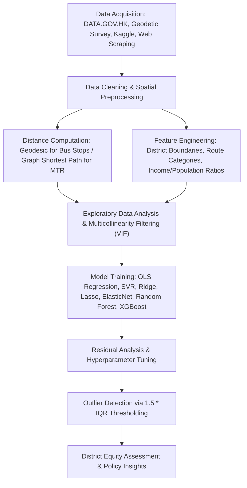

# Analyzing Public Transportation Fare Discrepancies in Hong Kong

A data science project examining public transportation pricing equity across Hong Kong's 18 administrative districts. Using multi-source geospatial, socio-economic, and routing data, this study benchmarks bus and MTR fare structures against regression and ensemble machine learning models to identify statistical pricing anomalies.

---

## Table of Contents

- [Project Overview](#-project-overview)
- [Key Findings](#-key-findings)
- [Methodological Evolution](#-methodological-evolution)
- [System Architecture & Workflow](#-system-architecture--workflow)
- [Data Sources](#-data-sources)
- [Modeling & Performance](#-modeling--performance)
- [Outlier Detection Framework](#-outlier-detection-framework)
- [Repository Structure](#-repository-structure)
- [Installation & Setup](#-installation--setup)
- [Contributors & Course Information](#-contributors--course-information)

---

## Project Overview

Public transit accounts for approximately 11.5 million daily trips in Hong Kong, with franchised buses and the Mass Transit Railway (MTR) serving as core modalities. While recognized globally for efficiency, persistent public debates exist regarding fare burdens placed on peripheral districts (e.g., Tuen Mun, Yuen Long, Islands).

This project addresses these debates through quantitative analysis:
1. **Determinants Analysis:** Quantifying the actual impact of journey distance, tunnel crossings, route types, and service providers on fares.
2. **Equity Evaluation:** Establishing statistical criteria to distinguish legitimate operational costs (infrastructure tolls, long hauls) from disproportionately high fares.
3. **Multi-Modal Comparison:** Contrasting bus pricing dynamics (flat-rate tiered structures) with MTR network pricing.

---

## Key Findings

- **Bus System Disparities:** 
  - Fares are predominantly driven by **route grouping / harbour crossings** and **journey distance**. 
  - Using an upper-bound outlier threshold ($Q_3 + 1.5 \times \text{IQR}$ on predicted fare residuals / fare thresholds), **Tuen Mun (21.0%)** and **Yuen Long (18.5%)** exhibited the highest concentration of "unreasonably expensive" bus routes.
- **MTR Fare Uniformity:** 
  - Fares follow a tightly regularized distance-based structure ($R^2 = 0.96$).
  - Once tourism/specialized stations (Disneyland Resort, Racecourse, cross-border stations like Lo Wu & Lok Ma Chau) were filtered out, **0% to 2%** of standard routes across most districts were identified as statistical outliers, indicating high systemic pricing equity across typical daily commuter paths.

---

## Methodological Evolution

A core innovation in this project was recognizing and adapting to domain-specific pricing mechanics:

| Dimension | Initial Approach | Revised Approach | Impact / Rationale |
| :--- | :--- | :--- | :--- |
| **Bus Target Metric** | Average fare per kilometer ($\text{HKD/km}$) | **Raw Fare ($\text{HKD}$)** with distance as a covariate | The $\text{HKD/km}$ approach distorted flat-fare short trips, masked starting base fares, and yielded low $R^2 \approx 0.30$. Modeling raw fare elevated $R^2$ to **0.88+**. |
| **MTR Graph Routing** | Geodesic (straight-line) coordinates | **Graph Shortest-Path** via NetworkX (`MTR_Edges_Data`) | Real track geometry deviates heavily from Euclidean lines (e.g., Tsuen Wan to Sha Tin is $\approx 7\text{ km}$ straight line vs. $14.3\text{ km}$ rail transit). Corrected network distances increased model $R^2$ from 0.90 to 0.96. |
| **Exclusions** | None | Filtered specialized & tourist routes | Removed airport buses (A/E/NA routes), border crossing terminals (Lo Wu, Lok Ma Chau), Racecourse station, and Disneyland Resort line to prevent distorting commuter-focused baselines. |

---

## System Architecture & Workflow


---

## Data Sources

1. **Bus Route & Fare Data:** Sourced via [DATA.GOV.HK](https://data.gov.hk/) (Transport Department's "Routes and Fares of Bus").
2. **MTR Fares & Stations:** Government CSV database on adult Octopus fares, paired with [Kaggle MTR Subway Network](https://www.kaggle.com/datasets/d1om3d3s/hong-kong-mtr-network) edge datasets.
3. **Spatial Boundaries:** `hksar_18_district_boundary.json` from the Hong Kong Home Affairs Department.
4. **Socioeconomic Indicators:** Census and Statistics Department (2022 Median Household Income and Population Density by District).
5. **Enrichment Scraping:** Route categorizations and coordinates extracted from Wikipedia and Citybus airport service pages.

---

## Modeling & Performance

### 1. Bus Fare Modeling

After excluding trips $< 1\text{ km}$ (active transit walkability threshold) and airport routes:

| Model | $R^2$ | RMSE (HKD) | MAE (HKD) | Key Features / Notes |
| --- | --- | --- | --- | --- |
| **OLS Regression** | 0.69 | — | — | Exhibited heteroscedasticity; improved to $R^2 = 0.71$ via log transformation. |
| **Random Forest** | 0.88 | 2.18 | 1.22 | Captured non-linear interactions; Distance & Cross-Harbour Tunnels ranked highest. |
| **Tuned XGBoost** | **0.882** | **2.17** | **1.28** | Best generalization; 95% of predictions within $\pm 10\text{ HKD}$ of actual fares. |

### 2. MTR Fare Modeling

| Iteration | Random Forest ($R^2$) | Tuned XGBoost ($R^2$) | Linear Regression ($R^2$) | Primary Enhancements |
| --- | --- | --- | --- | --- |
| **Initial Geodesic** | 0.91 | 0.90 | 0.77 | Euclidean distances between station lat/long. |
| **Network Graph Routing** | 0.92 | 0.92 | 0.80 | Shortest path along actual track topology. |
| **Filtered Specialized Stations** | **0.96** | **0.96** | **0.83** | Removed Disneyland & Racecourse stations. |

---

## Outlier Detection Framework

To determine whether a given route is "unreasonably expensive," we evaluate model prediction residuals:

$$\text{Fare Residual} = \text{Fare}_{\text{actual}} - \text{Fare}_{\text{predicted}}$$

$$\text{Threshold} = Q_3 + 1.5 \times (Q_3 - Q_1)$$

Any route exceeding this upper statistical bound is classified as an anomaly, providing an objective evaluation that separates legitimate operating/distance factors from disproportionate pricing.

---

## Repository Structure

```text
├── main.ipynb                    # Primary analysis notebook containing end-to-end code
├── COMP3522 Final Report.pdf     # Full project report and documentation
├── data/                         # District boundaries, route datasets, and socioeconomic CSVs
└── README.md                     # Project documentation
```

---

## Installation & Setup

### Prerequisites

* Python 3.9+
* Jupyter Notebook / JupyterLab

### Dependencies

Install the required packages:
pip install numpy pandas matplotlib seaborn scikit-learn xgboost networkx geopy


### Running the Analysis

1. Clone the repository:
git clone [https://github.com/an0421/HK-Transportation-Project.git](https://github.com/an0421/HK-Transportation-Project.git)
cd HK-Transportation-Project

2. Launch the notebook:
jupyter notebook main.ipynb

3. Run all cells sequentially to reproduce the data processing, model benchmarking, and visualizations.

---

## Contributors & Course Information

This project was completed as part of **COMP3522** (Real-life Data Science) at the University of Hong Kong:

* **Lie Warren Leander** 
* **Winiera Sutanto** 
* **Huang Da Fang** 
* **Clara Natalie Surjadjajadi** 
